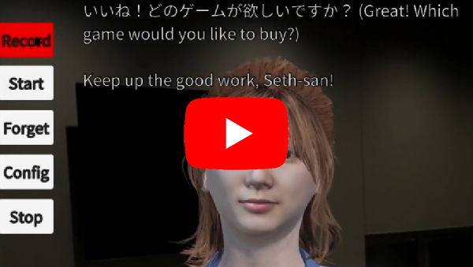
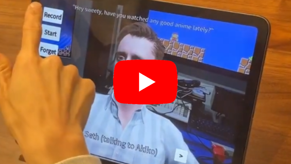

# GPTAvatar: 3D AI Virtual Chatbot made in Unity

License:  BSD style attribution, see [LICENSE.md](LICENSE.md)

Interested in Education and AI?  Check out this paper I collaborated on: Fink, M. C., Robinson, S. A., & Ertl, B. (2024, March 27). AI-Based Avatars Are Changing the Way We Learn and Teach: Benefits and Challenges. https://doi.org/10.35542/osf.io/jt83m

This is a technology test that uses APIs from OpenAI, ElevenLabs, and Google to allow a 3D AI character to converse with using a microphone.

It includes three "scenarios":

 * Japanese teacher - Atsuko sensei can teach any level Japanese.  She can create quizes or roleplay situations, like working at a store or whatever.
 * Seth - It's me!  You can talk to me.  Do not trust anything I say.  Unfortunately I can't share the custom voice I trained using ElevenLabs, so it's using a default one.
 * Big Burger - Order your food from the rudest fast food employee in the universe

New to AI with Unity?  Check the Assets/RT/AI directory, you'll see some simple ways to make API calls, that's what this app is using.  The 3D visuals are just for fun.

BTW, it is possible to build this on Windows, Mac, and iOS.  The iOS build would need to be tweaked to load the config.txt a different way.  (I originally had it running on iOS but wanted to move the config.txt to a separate file for easier editing and haven't tried it since)

Note:  The "copy" button puts the dialog into the system clipboard, useful to get at the kanji if you're doing Japanese practice.

# Running it

 * Download [GPTAvatar (Windows, 300 MB)](https://www.rtsoft.com/files/GPTAvatar_Windows.zip) and unzip it somewhere
 * Rename config_template.txt to config.txt
 * Edit config.txt with a text editor, at a minimum you need to add your OpenAI API key.  Other API keys are required for "speaking", if you leave them blank the character won't actually talk.
 
 That's it.  If you have any problems, check the directory for files like tts_last_error_returned.json or similar, you can edit them with a text editor to see what's going on.

 To change the personality or add more characters, edit the config.txt, you'll see how.

 WARNING: These APIs cost real money to use, so watch out.  The ElevenLabs voices are probably the most pricey thing of all (but damn they sound real!), so consider switching to using Google's TTS instead to save money, just edit the config.txt for that character. The "teacher" is already set to use Google as Elevenlabs can't do Japanese.

 API keys are simple to get and use (sign up, put in credit card, get API key) except for Google, it's a little more convoluted, might want to google "How to get a TTS API key from Google".  The Google key is only used for the voice of the Japanese teacher currently.

 ## GPT-3 vs GPT-4

 I've set the default in the config.txt to "gpt-3.5-turbo", but you should change this to "gpt-4" if you have access to that.  (At this time its API is not available to all)  Nearly all my testing and settings are for gpt-4 so uh.. if using gpt-3, while it works, it probably needs some tweaks as it's expecting 8k of token space which it doesn't have in that case.  
 
 The gpt-4 API will probably be avaiable to all soon though.

# Building from this github source

* Requires Unity 2022.2+
* Open the scene "Main" and click play to run, it will give errors

To fix the errors, you'll need to buy [SALSA LipSync Suite](https://assetstore.unity.com/packages/tools/animation/salsa-lipsync-suite-148442) from the Unity asset store

* After installing the main plugin, also install the oneclickbase 2_5_0_2 package and oneclickcc 2_6_2 package, these are available from https://crazyminnowstudio.com/docs/salsa-lip-sync/addons/one-clicks/
 * In the file Assets/_Script/AIManager.cs make sure that #define CRAZY_MINNOW_PRESENT is uncommented
 * In the Unity editor, select the root 3d node that has the Animator object (Visuals/char_visual_seth/Seth) for example and then from the menu bar choose GameObject->Crazy Minnow Studio->Salsa LipSync->Oneclicks->Reallusion->CC4.  The Salsa objects on that entity should be enabled now and work in the game.  (The Salsa objects should turn blue) You'll have to do it to the teacher model too.
* If you want the model's eyes to look at the camera, you have to set the eye target to the camera. (only works right with the teacher)

Alternatively, you can ditch the lip syncing tech by editing Assets/_Script/AIManager.cs and commenting out #define CRAZY_MINNOW_PRESENT 

Note that when running from the Unity editor, it does more debug stuff, it writes out every .json it sends/receives for debugging purposes.
---

Credits and links

- Written by Seth A. Robinson (seth@rtsoft.com) twitter: @rtsoft - [Codedojo](https://www.codedojo.com), Seth's blog

Note:  The license only applies to my source code, for sound/graphics, uh, it might be complicated so don't count on being able to use any of that in a real product.

Engine: Unity

Listening: Whisper (via OpenAI's API)

Thinking: ChatGTP (via OpenAI's API)

Talking: ElevenLabs' Voicelab (trained on my voice)

3D Model: Reallusion's Headshot (model faces created using my picture and AI)

Lipsync: SALSA Lipsync Suite